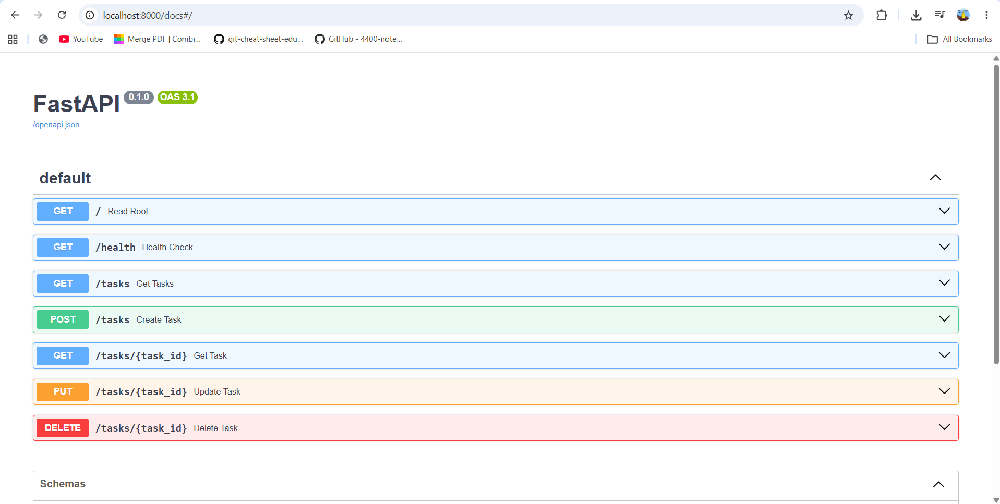
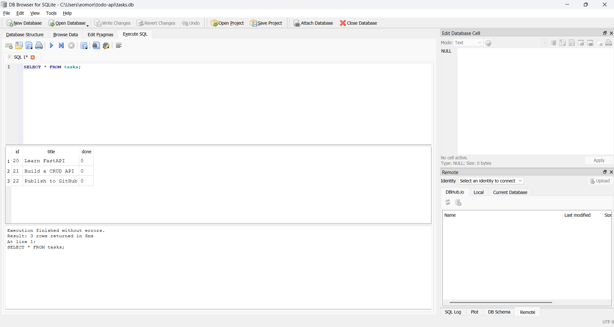

# Task API

A simple REST API built with **Python**, **FastAPI**, **SQLite**, and **Uvicorn** for managing a to-do list. The API supports full CRUD operations with persistent storage using SQLite, allowing task data to remain available after the server is restarted.

---

## Features

- ✅ Create, Read, Update, and Delete tasks
- ✅ Persistent storage using SQLite
- ✅ Input validation for task titles
- ✅ Health check endpoint
- ✅ Interactive Swagger UI documentation
- ✅ FastAPI automatic OpenAPI documentation

---

## Technologies Used

- Python 3.x
- FastAPI
- SQLite
- sqlite3
- Uvicorn

---

## API Endpoints

| Method | Endpoint | Description |
|--------|----------|-------------|
| GET | `/` | API information |
| GET | `/health` | Health check |
| GET | `/tasks` | List all tasks |
| GET | `/tasks/{id}` | Retrieve a task by ID |
| POST | `/tasks` | Create a task |
| PUT | `/tasks/{id}` | Update a task |
| DELETE | `/tasks/{id}` | Delete a task |

---

## Installation

### Clone the repository

```bash
git clone https://github.com/EmmanuelOmonua/todo-api.git
cd todo-api
```

### Create a virtual environment

```bash
python -m venv venv
```

### Activate the virtual environment

**Windows**

```bash
venv\Scripts\activate
```

**macOS/Linux**

```bash
source venv/bin/activate
```

### Install dependencies

```bash
pip install -r requirements.txt
```

### Start the server

```bash
uvicorn main:app --reload
```

The server will start at:

```
http://localhost:8000
```

---

## Docker Setup (Stage 0)

To spin up the PostgreSQL database in a Docker container with persistent volume storage, run:

`docker run --name taskdb -e POSTGRES_PASSWORD=dev -e POSTGRES_DB=tasks -p 5432:5432 -v taskdata:/var/lib/postgresql -d postgres`

---

### Verify Database Container

You can inspect the running container and access the SQL prompt using `psql`:

`docker exec -it taskdb psql -U postgres -d tasks`

---

## API Documentation

FastAPI automatically generates interactive documentation.

Open:

```
http://localhost:8000/docs
```

---

## Database

The API uses SQLite because it is a lightweight, serverless database stored in a single file (`tasks.db`). It requires zero database setup, is included with Python through the `sqlite3` module, and allows task data to survive application restarts.

On first startup, the application automatically:

- Creates the `tasks` table if it does not already exist.
- Seeds the database with three example tasks if the table is empty.

Because the API and SQLite database share the same database file, changes made through the API or directly in SQLite are immediately reflected without restarting the server.

The database file (`tasks.db`) is created automatically the first time the application starts and is not committed to the repository.

---

## Example Request

```bash
curl http://localhost:8000/tasks
```

Example response:

```json
[
  {
    "id": 1,
    "title": "Learn FastAPI",
    "done": false
  },
  {
    "id": 2,
    "title": "Build a CRUD API",
    "done": false
  },
  {
    "id": 3,
    "title": "Publish to GitHub",
    "done": false
  }
]
```

---

## Project Structure

```
todo-api/
│
├── main.py
├── ai-version/
│   ├── main.py
│   └── requirements.txt
├── README.md
├── requirements.txt
├── swagger-screenshot.png
└── .gitignore
```

---

## Screenshot



---

## SQLite Exploration

During Stage 4, I explored the SQLite database directly using **DB Browser for SQLite**.

### Example SQL Query

```sql
SELECT COUNT(*) FROM tasks;
```

## SQLite Database



### Result

This query returned the total number of tasks stored in the database. I used it to verify the number of records in the `tasks` table before modifying the data through SQL.

I also verified that changes made directly in the SQLite database were immediately reflected through the API without restarting the FastAPI server.

---

## AI vs me

For Stage 6, I asked Claude to migrate my original in-memory FastAPI task API to use SQLite while keeping the API behavior the same. I placed the AI-generated version in the `ai-version/main.py` folder so it could be compared with my hand-written implementation.

**My prompt:**

> Convert my existing FastAPI task API from using an in-memory Python list to using SQLite. Use Python's built-in `sqlite3` module. Create a `tasks` table with `id`, `title`, and `done` columns if it doesn't exist, and seed three example tasks only if the table is empty. Keep the same CRUD endpoints and preserve the existing API behavior, including the same HTTP status codes (`201`, `200`, `204`, `400`, `404`) and JSON error responses. Use parameterized SQL queries (? placeholders) for safety. Store task data in `tasks.db` so it survives server restarts.

**Running it:** The generated application started successfully, automatically created `tasks.db`, seeded the database only once, and preserved data after restarting the server. I tested all CRUD endpoints and confirmed that task creation, retrieval, updating, deletion, and persistence behaved correctly.

**What it did better:**

- It created helper functions (`get_conn()`, `init_db()`, and `row_to_task()`) that made the database code cleaner and easier to maintain.
- It consistently used parameterized SQL queries, improving readability and preventing SQL injection.
- It converted the SQLite integer values (`0` and `1`) into Python booleans before returning JSON responses, keeping the API output clean.
- During the rematch, Claude improved the implementation by using a single shared SQLite connection protected by a thread lock instead of opening and closing a database connection for every request. This reduced repeated connection overhead while remaining thread-safe.

**What it got wrong or quietly ignored:**

- It preserved additional endpoints from the original AI version (`/stats`, `/reset`, and task filtering), even though they were not required by the assignment specification.
- It seeded different example tasks ("Buy milk" and "Write README") instead of matching the sample data from my project.
- It did not generate a `requirements.txt` file even though the original AI project included one.

**What my prompt forgot to specify:**

- My prompt described the required SQLite migration but did not specify how database connections should be managed, whether helper functions should be created, or whether the original sample tasks needed to remain exactly the same. Because those details were omitted, Claude made its own implementation decisions.

**One rematch:**

After reviewing the generated code, I refined my prompt to request a single shared SQLite connection instead of opening and closing a connection for every request. The regenerated version replaced the repeated connection logic with one shared connection protected by a thread lock, producing cleaner and more efficient database access.

---

## Author

**Emmanuel Omonua**
